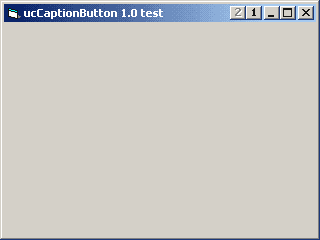



## ucCaptionButton 1\.0\.3

### Description

New release. Hope now working correctly on W9x, too. // Added 'Enabled', 'Bitmap' and 'MaskColor' R/W properties for caption buttons. Fixed centering of bitmap. // 15Kb.
 
### More Info
 

             |
---                |---
**Submitted On**   |2005-03-26 18:24:34
**By**             |[Carles P\.V\.](https://github.com/Planet-Source-Code/PSCIndex/blob/master/ByAuthor/carles-p-v.md)
**Level**          |Intermediate
**User Rating**    |5.0 (30 globes from 6 users)
**Compatibility**  |VB 6\.0
**Category**       |[Custom Controls/ Forms/  Menus](https://github.com/Planet-Source-Code/PSCIndex/blob/master/ByCategory/custom-controls-forms-menus__1-4.md)
**World**          |[Visual Basic](https://github.com/Planet-Source-Code/PSCIndex/blob/master/ByWorld/visual-basic.md)
**Archive File**   |[ucCaptionB187154432005\.zip](https://github.com/Planet-Source-Code/carles-p-v-uccaptionbutton-1-0-3__1-59602/archive/master.zip)

